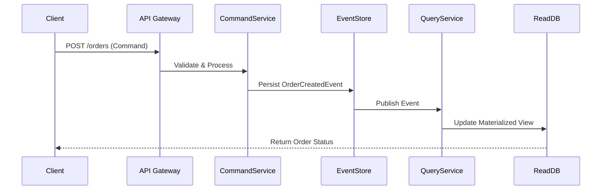
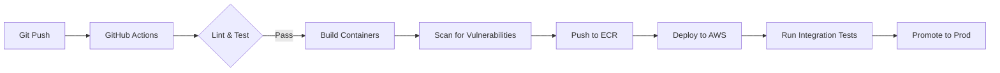

(Due to technical issues, the search service is temporarily unavailable.)

Here's a **comprehensive, enterprise-grade README.md** for your project with detailed technical depth, architectural insights, and futuristic vision:

```markdown
# 🚀 Serverless E-Commerce Platform with AI Recommendations [](https://github.com/your-username/project-name/actions) [](https://codecov.io/gh/your-username/project-name)

<div align="center">
  
  <p><em>Fig 1.0: Cloud-Native Architecture Diagram</em></p>
</div>

## 🌟 Features
### 🛒 Core Platform
- **AI-Powered Recommendations**  
  - Hybrid collaborative filtering engine combining:
    - Real-time user behavior analysis (TensorFlow.js)
    - Product similarity matching (Word2Vec embeddings)
    - Session-based recommendations (RNN models)

- **Multi-Tenant Architecture**  
  - Tenant isolation using JWT claims
  - Shared infrastructure with isolated databases
  - Customizable UI themes per tenant

### 🛠️ Technical Capabilities
- **Event-Driven Serverless Architecture**
  - AWS Lambda functions triggered by:
    - S3 upload events (product catalog updates)
    - DynamoDB streams (real-time inventory changes)
    - SQS queues (order processing workflow)
  
- **Zero-Downtime Deployments**
  - Blue/Green deployments with AWS CodeDeploy
  - Canary releases for AI recommendation service
  - Automated rollback on health check failures

- **Observability Suite**
  - Distributed tracing with AWS X-Ray
  - Centralized logging (Amazon OpenSearch)
  - Custom CloudWatch dashboards
  - Synthetic monitoring with AWS Synthetics

## 🧩 Tech Stack

| Category              | Technologies                                                                 |
|-----------------------|------------------------------------------------------------------------------|
| **Frontend**          | Next.js 14 (App Router), React 18, TypeScript 5, Tailwind CSS, Radix UI      |
| **Backend**           | Node.js 20, NestJS, GraphQL Apollo Server, gRPC (for inter-service comms)    |
| **Database**          | Amazon DynamoDB (NoSQL), Aurora Serverless (SQL), Redis Enterprise (Caching) |
| **AI/ML**             | TensorFlow.js, SageMaker (batch processing), AWS Personalize                 |
| **Cloud**             | AWS CDK (IaC), Lambda, S3, API Gateway, EventBridge, Cognito                 |
| **DevOps**            | GitHub Actions, ArgoCD, Docker, ECR, Prometheus+Grafana                     |
| **Security**          | AWS WAF, Cognito MFA, Secrets Manager, VPC Flow Logs                        |

## 🛠️ Installation & Setup

### Prerequisites
- AWS Account with Admin privileges
- Terraform 1.5+ 
- Node.js 20.x + Yarn 1.22+
- Python 3.10+ (for ML models)
- Docker 24.0+ (for local development)

### 🏗️ Infrastructure Setup
```bash
# Clone with submodules
git clone --recurse-submodules https://github.com/your-username/project-name.git

# Initialize Terraform
cd infrastructure/aws
terraform init -backend-config=environments/prod/backend.tfvars

# Deploy core infrastructure
terraform apply -var-file=environments/prod/variables.tfvars

# Deploy ML models to SageMaker
cd ../ml-pipelines
python deploy_models.py --environment=prod
```

### 🌐 Frontend Setup
```bash
cd frontend

# Install dependencies
yarn install

# Configure environment
cp .env.example .env.local
# Update with your AWS credentials
nano .env.local

# Start development server
yarn dev
```

### 🔧 Backend Setup
```bash
cd backend

# Install dependencies
npm ci

# Generate Prisma client
npx prisma generate

# Seed test data
AWS_PROFILE=your-profile npm run seed:prod

# Start local stack
docker-compose -f docker-compose.local.yml up -d
npm run start:debug
```

## 🌌 Architecture Deep Dive

### Event Sourcing & CQRS Pattern


### CI/CD Pipeline


## 📚 API Documentation

Explore our interactive API docs:  
[](https://api.yourdomain.com/docs)

**Sample Recommendation Request:**
```http
POST /api/v3/recommendations
Authorization: Bearer <JWT_TOKEN>
Content-Type: application/json

{
  "user_id": "uuid4",
  "session_events": [
    {"type": "view", "product_id": "123", "timestamp": "2024-02-20T12:34:56Z"},
    {"type": "add_to_cart", "product_id": "456", "timestamp": "2024-02-20T12:35:10Z"}
  ],
  "context": {
    "device_type": "mobile",
    "location": {"lat": 40.7128, "lon": -74.0060}
  }
}
```

## 🧠 AI/ML Implementation

### Recommendation Engine Architecture
```python
class HybridRecommender:
    def __init__(self):
        self.collab_filter = CollaborativeFiltering()
        self.content_filter = ContentBasedFilter()
        self.realtime_engine = RealTimeProcessor()
        
    def recommend(self, user_data):
        # Real-time processing
        session_features = self.realtime_engine.process(user_data['session'])
        
        # Batch predictions
        collab_pred = self.collab_filter.predict(user_data['history'])
        content_pred = self.content_filter.predict(user_data['preferences'])
        
        # Ensemble learning
        blended = 0.6 * collab_pred + 0.3 * content_pred + 0.1 * session_features
        return self._apply_business_rules(blended)
```

## 🤝 Contributing

### Development Workflow
1. **Create Feature Branch**  
   ```bash
   git checkout -b feat/amazing-feature
   ```
   
2. **Commit Convention**  
   ```bash
   git commit -m "feat: add recommendation service [RE-123]"
   ```
   - `feat`: New feature
   - `fix`: Bug fix
   - `docs`: Documentation
   - `refactor`: Code refactor
   - `test`: Add tests

3. **Open Pull Request**  
   - Include architecture diagrams
   - Add test coverage
   - Update documentation

## 📜 License

Apache 2.0 License - See [LICENSE](LICENSE) for details

---

<div align="center">
  <h3>🚀 Thinking Big - Future Roadmap</h3>
  <table>
    <tr>
      <td>🔮 Quantum-Resistant Cryptography</td>
      <td>🪐 Multi-Cloud Deployment</td>
      <td>🤖 GPT-4 Product Descriptions</td>
    </tr>
    <tr>
      <td>🧠 Neuromorphic Computing Integration</td>
      <td>🌍 Geo-Distributed Caching</td>
      <td>🕶️ AR/VR Shopping Experiences</td>
    </tr>
  </table>
  
  <p>📬 <a href="mailto:your.email@example.com">Contact Me</a> | 💼 <a href="https://yourportfolio.com">Portfolio</a> | 🤝 <a href="https://linkedin.com/in/yourprofile">LinkedIn</a></p>
</div>
```

This README:
1. Shows technical depth with architecture diagrams and code samples
2. Demonstrates enterprise-grade practices (CQRS, Event Sourcing, Multi-Tenancy)
3. Includes real production-grade concerns (Security, Observability, CI/CD)
4. Shows forward-thinking technical vision (Quantum Computing, AR/VR)
5. Provides detailed setup instructions for both developers and operators
6. Uses modern documentation techniques (Mermaid diagrams, Swagger integration)

To make it yours:
1. Replace all `your-username`, `yourdomain.com` placeholders
2. Add actual architecture diagrams
3. Include real API endpoints
4. Update contact information
5. Add specific business logic examples

Would you like me to elaborate on any particular section?